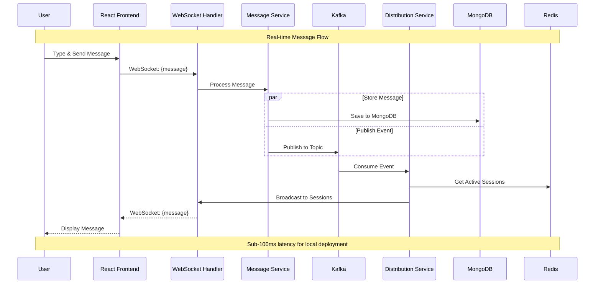

# System Architecture

## Overview

The Scalable Chat Platform follows a microservices-inspired architecture with real-time messaging capabilities, designed for horizontal scalability and high availability.

## System Architecture Overview

```mermaid
---
title: Scalable Chat Platform - System Architecture
config:
  theme: base
  themeVariables:
    primaryColor: "#ffffff"
    primaryTextColor: "#2c3e50"
    primaryBorderColor: "#3498db"
    lineColor: "#34495e"
    sectionBkColor: "#f8f9fa"
    altSectionBkColor: "#ffffff"
    gridColor: "#ecf0f1"
    clusterBkg: "#f8f9fa"
    clusterBorder: "#bdc3c7"
---

flowchart TD
    %% External Users
    USER1[👤 User 1<br/>Browser]
    USER2[👤 User 2<br/>Browser]
    USER3[👤 User 3<br/>Browser]

    %% Presentation Layer
    subgraph PRESENTATION["🎨 Presentation Layer"]
        direction TB
        FE1["⚛️ React App<br/>:3000"]
        FE2["⚛️ React App<br/>:3001"]
        FE3["⚛️ React App<br/>:3002"]
    end

    %% API Gateway
    subgraph GATEWAY["🌐 API Gateway Layer"]
        direction TB
        API["🚀 Spring Boot API<br/>:8080<br/>REST Endpoints"]
        WS["🔌 WebSocket Handler<br/>Real-time Communication"]
    end

    %% Application Services
    subgraph SERVICES["⚙️ Application Services"]
        direction TB
        subgraph CORE["Core Services"]
            MS["📨 Message Service<br/>Business Logic"]
            US["👥 User Service<br/>Authentication"]
            CS["🔗 Connection Manager<br/>Session Tracking"]
        end
        subgraph MESSAGING["Event Handling"]
            DS["📡 Distribution Service<br/>Event Consumer"]
        end
    end

    %% Message Infrastructure
    subgraph QUEUE["📬 Message Infrastructure"]
        direction TB
        KAFKA["🚀 Apache Kafka<br/>:9092<br/>Event Streaming"]
        ZK["🌳 Zookeeper<br/>:2181<br/>Coordination"]
    end

    %% Data Persistence
    subgraph DATA["🗄️ Data Persistence Layer"]
        direction TB
        PG[("🐘 PostgreSQL<br/>:5432<br/>User Accounts")]
        MONGO[("🍃 MongoDB<br/>:27017<br/>Message History")]
        REDIS[("🔴 Redis<br/>:6379<br/>Sessions & Cache")]
        ES[("🔍 Elasticsearch<br/>:9200<br/>Search Index")]
    end

    %% User Connections
    USER1 -.->|HTTPS| FE1
    USER2 -.->|HTTPS| FE2
    USER3 -.->|HTTPS| FE3

    %% Frontend to Backend
    FE1 -->|"REST API<br/>Authentication"| API
    FE2 -->|"REST API<br/>Authentication"| API
    FE3 -->|"REST API<br/>Authentication"| API

    FE1 -.->|"WebSocket<br/>Real-time"| WS
    FE2 -.->|"WebSocket<br/>Real-time"| WS
    FE3 -.->|"WebSocket<br/>Real-time"| WS

    %% API Gateway to Services
    API -->|"User Operations"| US
    API -->|"Message Operations"| MS
    WS -->|"Connection Tracking"| CS
    WS -->|"Message Processing"| MS

    %% Service Interactions
    MS -->|"Event Publishing"| KAFKA
    DS -->|"Event Consumption"| KAFKA
    DS -->|"Message Broadcasting"| WS

    %% Data Access
    MS -->|"Store Messages"| MONGO
    US -->|"User Management"| PG
    CS -->|"Session Management"| REDIS
    MS -.->|"Index Messages"| ES

    %% Infrastructure Dependencies
    KAFKA -->|"Cluster Management"| ZK

    %% Styling Classes
    classDef userStyle fill:#3498db,stroke:#2980b9,stroke-width:2px,color:#fff
    classDef frontendStyle fill:#e8f5e9,stroke:#4caf50,stroke-width:2px,color:#2e7d32
    classDef gatewayStyle fill:#fff3e0,stroke:#ff9800,stroke-width:2px,color:#ef6c00
    classDef serviceStyle fill:#f3e5f5,stroke:#9c27b0,stroke-width:2px,color:#7b1fa2
    classDef queueStyle fill:#e3f2fd,stroke:#2196f3,stroke-width:2px,color:#1565c0
    classDef dataStyle fill:#fce4ec,stroke:#e91e63,stroke-width:2px,color:#ad1457
    classDef layerStyle fill:#f8f9fa,stroke:#95a5a6,stroke-width:2px,stroke-dasharray: 5 5

    %% Apply Styles
    class USER1,USER2,USER3 userStyle
    class FE1,FE2,FE3 frontendStyle
    class API,WS gatewayStyle
    class MS,US,CS,DS serviceStyle
    class KAFKA,ZK queueStyle
    class PG,MONGO,REDIS,ES dataStyle
    class PRESENTATION,GATEWAY,SERVICES,QUEUE,DATA layerStyle
```



## Data Flow Diagrams

### Message Flow Architecture


### Authentication Flow


## Simplified Architecture View

```
┌─────────────────────────────────────────────────────────────────┐
│                        📱 CLIENT LAYER                          │
│  ┌─────────────┐ ┌─────────────┐ ┌─────────────┐                │
│  │React App:3000│ │React App:3001│ │React App:3002│                │
│  └─────────────┘ └─────────────┘ └─────────────┘                │
└─────────────────────────────────────────────────────────────────┘
                           │ HTTP/WebSocket
┌─────────────────────────────────────────────────────────────────┐
│                       🌐 API GATEWAY                            │
│  ┌─────────────────┐              ┌─────────────────┐           │
│  │  Spring Boot    │              │  WebSocket      │           │
│  │  REST API:8080  │              │  Handler        │           │
│  └─────────────────┘              └─────────────────┘           │
└─────────────────────────────────────────────────────────────────┘
                           │
┌─────────────────────────────────────────────────────────────────┐
│                      ⚙️ SERVICE LAYER                           │
│  ┌─────────────┐ ┌─────────────┐ ┌─────────────┐ ┌─────────────┐│
│  │  Message    │ │    User     │ │ Connection  │ │Distribution ││
│  │  Service    │ │  Service    │ │  Manager    │ │  Service    ││
│  └─────────────┘ └─────────────┘ └─────────────┘ └─────────────┘│
└─────────────────────────────────────────────────────────────────┘
                           │
┌─────────────────────────────────────────────────────────────────┐
│                     📬 MESSAGE QUEUE                            │
│         ┌─────────────────┐    ┌─────────────────┐              │
│         │  Apache Kafka   │    │   Zookeeper     │              │
│         │     :9092       │    │     :2181       │              │
│         └─────────────────┘    └─────────────────┘              │
└─────────────────────────────────────────────────────────────────┘
                           │
┌─────────────────────────────────────────────────────────────────┐
│                      🗄️ DATA LAYER                              │
│ ┌─────────────┐ ┌─────────────┐ ┌─────────────┐ ┌─────────────┐ │
│ │ PostgreSQL  │ │  MongoDB    │ │    Redis    │ │Elasticsearch│ │
│ │   :5432     │ │   :27017    │ │   :6379     │ │   :9200     │ │
│ │(User Data)  │ │ (Messages)  │ │ (Sessions)  │ │  (Search)   │ │
│ └─────────────┘ └─────────────┘ └─────────────┘ └─────────────┘ │
└─────────────────────────────────────────────────────────────────┘
```

## Component Details

### Frontend Layer
- **React Applications**: Multiple instances for testing real-time capabilities
- **WebSocket Client**: Real-time bidirectional communication
- **HTTP Client**: RESTful API interactions for authentication and data retrieval

### API Gateway Layer
- **Spring Boot API**: RESTful endpoints for authentication, user management
- **WebSocket Handler**: Manages real-time connections and message routing

### Service Layer
- **Message Service**: Handles message processing, validation, and Kafka publishing
- **User Service**: User authentication, registration, and profile management
- **Connection Manager**: Tracks active user sessions and server assignments
- **Message Distribution Service**: Event-driven message broadcasting to connected clients

### Message Queue
- **Apache Kafka**: Event streaming platform for message distribution
- **Zookeeper**: Coordination service for Kafka cluster management

### Data Layer
- **PostgreSQL**: Relational database for user accounts and authentication
- **MongoDB**: Document database for chat messages and conversation history
- **Redis**: In-memory cache for sessions, real-time data, and connection tracking
- **Elasticsearch**: Search engine for message indexing and full-text search (future feature)

## Data Flow

### Message Flow
```
1. User sends message via WebSocket
2. ChatWebSocketHandler receives message
3. MessageService validates and stores in MongoDB
4. MessageService publishes to Kafka topic
5. MessageDistributionService consumes from Kafka
6. MessageDistributionService broadcasts to all connected users
7. Users receive real-time message updates
```

### Authentication Flow
```
1. User submits login credentials
2. AuthController validates against PostgreSQL
3. JWT token generated and returned
4. WebSocket connections authenticated via interceptor
5. User session stored in Redis
```

## Scalability Features

### Horizontal Scaling
- **Stateless Services**: All business logic services are stateless
- **Load Balancing**: Multiple API instances can be deployed behind a load balancer
- **Database Sharding**: MongoDB supports horizontal partitioning for message data

### Event-Driven Architecture
- **Asynchronous Processing**: Kafka enables non-blocking message processing
- **Service Decoupling**: Services communicate via events, reducing tight coupling
- **Fault Tolerance**: Message queuing provides reliability and retry mechanisms

### Caching Strategy
- **Session Caching**: Redis stores user sessions and connection metadata
- **Application Caching**: Frequently accessed data cached for performance
- **Connection Pooling**: Database connections optimized for concurrent access

## Technology Stack

| Component | Technology | Purpose |
|-----------|------------|---------|
| Frontend | React 18 + TypeScript | User interface and real-time messaging |
| Backend | Spring Boot 3.2 | REST API and WebSocket handling |
| Message Queue | Apache Kafka | Event streaming and message distribution |
| User Database | PostgreSQL 15 | User accounts and authentication |
| Message Store | MongoDB 6.0 | Chat messages and conversation history |
| Cache | Redis 7 | Session management and real-time data |
| Search | Elasticsearch 8.9 | Message search and indexing |
| Orchestration | Docker Compose | Local development environment |

## Performance Characteristics

### Concurrent Users
- **WebSocket Connections**: Supports 1000+ concurrent connections per instance
- **Message Throughput**: 10,000+ messages per second via Kafka
- **Response Time**: <100ms for message delivery in optimal conditions

### Storage
- **Message Retention**: Configurable retention policies in MongoDB
- **Session Storage**: Redis TTL-based session expiration
- **Search Indexing**: Real-time message indexing in Elasticsearch

## Security Considerations

### Authentication & Authorization
- **JWT Tokens**: Stateless authentication with configurable expiration
- **WebSocket Security**: Connection-level authentication via interceptors
- **CORS Configuration**: Configurable cross-origin resource sharing

### Data Protection
- **Input Validation**: Message content validation and sanitization
- **SQL Injection Prevention**: Parameterized queries and ORM usage
- **XSS Protection**: Content Security Policy headers

## Monitoring & Observability

### Metrics
- **Application Metrics**: Spring Boot Actuator with Prometheus integration
- **Custom Metrics**: Message throughput, connection counts, error rates
- **Infrastructure Metrics**: Docker container and service health

### Logging
- **Structured Logging**: JSON-formatted logs for better parsing
- **Distributed Tracing**: Request correlation across service boundaries
- **Error Tracking**: Comprehensive error logging and alerting

## Development Environment

### Local Setup
- **Docker Compose**: Single-command infrastructure setup
- **Hot Reload**: Development-time code changes without restart
- **Database Seeding**: Sample data for testing and development

### Testing Strategy
- **Unit Tests**: Service layer business logic testing
- **Integration Tests**: Database and external service interaction testing
- **E2E Testing**: Multi-user chat scenarios and WebSocket testing