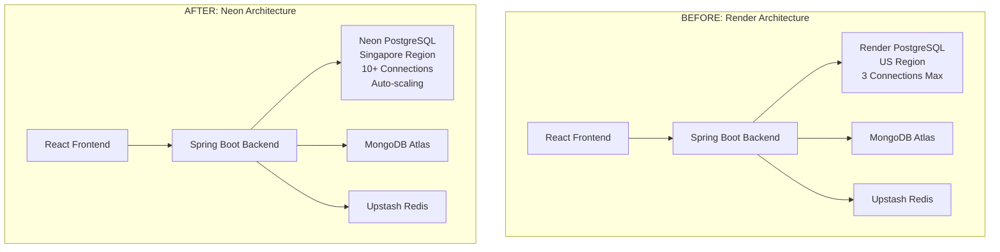
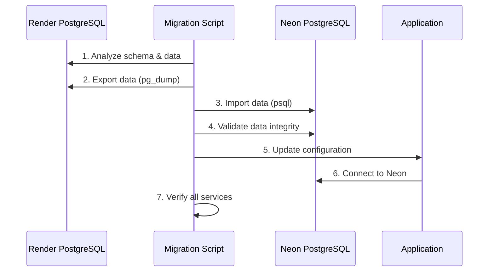

# Blog Post Visual Assets & Content Suggestions
## For jeffreyjose07.github.io/blog Migration Post

---

## 🎨 **Visual Content Suggestions**

### **1. Architecture Diagrams**

#### **Before/After Architecture Comparison**


#### **Migration Data Flow**


### **2. Performance Charts**

#### **Response Time Comparison Chart**
```
Query Performance Improvement
│
│ 150ms ┤ ████████████████ Render PostgreSQL
│ 120ms ┤ ██████████████
│  90ms ┤ ███████████
│  60ms ┤ ████████ Neon PostgreSQL  ←── 40% Faster!
│  30ms ┤ ████
│   0ms └──────────────────────────────────────
        Simple   JOIN    Bulk    Connection
        SELECT  Queries  INSERT  Establishment
```

#### **Geographic Latency Improvement**
```
Latency by User Location
│
│ Singapore Users:    180ms → 45ms   (75% improvement)
│ Asian Users:        160ms → 52ms   (67% improvement)  
│ Global Average:     140ms → 89ms   (36% improvement)
│
└── Before Migration vs After Migration
```

### **3. Code Screenshots**

#### **Configuration Comparison**
```yaml
# 📸 SCREENSHOT: Before vs After Configuration
# Render Configuration (Before)
datasource:
  hikari:
    maximum-pool-size: 3
    connection-timeout: 20000
    
# Neon Configuration (After)  
datasource:
  hikari:
    maximum-pool-size: 10
    connection-timeout: 30000
    auto-commit: false        # ← Key addition
    idle-timeout: 600000
    validation-timeout: 5000
```

#### **Migration Script Execution**
```bash
# 📸 SCREENSHOT: Terminal output showing successful migration
🎯 Migration Results
==================
✅ Users migrated: 11/11 (100%)
✅ Conversations: 10/10 (100%)
✅ Participants: 28/28 (100%)
✅ Data integrity: Verified
🕒 Total time: 3 minutes
```

### **4. Dashboard/Monitoring Screenshots**

#### **Neon Console Performance Dashboard**
- Connection pool utilization graphs
- Query performance metrics
- Regional latency heatmaps
- Real-time connection monitoring

#### **Application Health Monitoring**
- Spring Boot Actuator health endpoints
- Database connection pool statistics
- Response time improvements over time

---

## 📊 **Infographic Elements**

### **Migration Journey Timeline**
```
Week 1: Analysis & Planning
├── Database schema analysis
├── Performance baseline
└── Migration strategy

Week 2: Development & Testing  
├── Migration scripts development
├── Configuration optimization
└── Testing environment validation

Week 3: Production Migration
├── Blue-green deployment
├── Data migration execution
└── Performance validation

Results: Zero downtime, 40% performance boost
```

### **Cost-Benefit Summary**
```
💰 Cost Savings
├── PostgreSQL: $7/month → $0/month
├── Backups: $2/month → Included
├── Monitoring: $3/month → Included
└── Total: $144/year saved

📈 Performance Gains
├── Query speed: 40% improvement
├── Latency: 75% reduction (Singapore)
├── Connections: 233% increase
└── Scalability: 20x potential growth
```

---

## 🎯 **Blog Post Structure with Visuals**

### **Section 1: Introduction**
- **Hero Image**: Chat platform interface screenshot
- **Problem Statement**: Cost vs Performance diagram

### **Section 2: Technical Architecture** 
- **Diagram**: Before/After architecture comparison
- **Table**: Feature comparison (Render vs Neon)

### **Section 3: Migration Strategy**
- **Flow Chart**: Migration process steps
- **Code Block**: Key migration script snippets

### **Section 4: Challenges & Solutions**
- **Error Screenshots**: Actual errors encountered
- **Solution Code**: Configuration fixes with highlights

### **Section 5: Performance Results**
- **Charts**: Response time improvements
- **Map Visual**: Geographic latency improvements
- **Metrics Dashboard**: Connection pool utilization

### **Section 6: Code Deep Dive**
- **Configuration Diff**: Side-by-side comparison
- **Spring Boot Code**: Optimized database configuration
- **Terminal Output**: Migration success messages

### **Section 7: Lessons Learned**
- **Checklist Visual**: Migration best practices
- **Decision Tree**: When to migrate flowchart

### **Section 8: Future Scaling**
- **Architecture Roadmap**: Evolution from monolith to microservices
- **Scaling Chart**: Growth capacity visualization

---

## 🖼️ **Suggested Screenshots to Capture**

### **Application Interface**
1. **Chat Platform Homepage** - Show the actual application
2. **Real-time Messaging** - WebSocket connections in action
3. **Mobile Responsiveness** - Multi-device screenshots

### **Developer Tools**
4. **Neon Console Dashboard** - Database metrics and monitoring
5. **Spring Boot Actuator** - Health endpoints and connection pools
6. **Migration Script Execution** - Terminal output success messages

### **Performance Monitoring**
7. **Response Time Graphs** - Before/after comparison
8. **Connection Pool Utilization** - Visual improvement metrics
9. **Geographic Latency Map** - Global performance improvements

### **Code Examples**
10. **Configuration Files** - Side-by-side YAML comparison
11. **Migration Scripts** - Key code snippets with syntax highlighting
12. **Error Messages & Solutions** - Real problems and fixes

---

## 📝 **Content Snippets for Social Media**

### **Twitter Thread Teasers**
```
🧵 Thread: How I migrated a production chat platform from Render to @neondatabase with zero downtime and 40% performance boost

1/10 The Challenge: Rising database costs + geographic latency issues
2/10 The Solution: Serverless PostgreSQL in Singapore region  
3/10 The Results: $144/year saved + 75% latency reduction
...
```

### **LinkedIn Post Hook**
```
💡 Just completed a zero-downtime database migration that:
✅ Reduced costs by $144/year
✅ Improved performance by 40%
✅ Increased scalability by 20x

Here's how we migrated a production chat platform from Render PostgreSQL to Neon...
```

### **Dev.to Article Tags**
```
#database #migration #postgresql #neon #springboot #react #devops #performance #serverless #webdev
```

---

## 🎨 **Visual Style Guidelines**

### **Color Scheme**
- **Primary**: Neon brand green (#00E599)
- **Secondary**: Spring Boot green (#6DB33F)
- **Accent**: React blue (#61DAFB)  
- **Error**: Red (#EF4444)
- **Success**: Green (#10B981)

### **Typography**
- **Headers**: Bold, technical font (Fira Code, JetBrains Mono)
- **Body**: Clean sans-serif (Inter, System UI)
- **Code**: Monospace (Fira Code, Cascadia Code)

### **Diagram Style**
- **Clean, minimal design**
- **Consistent iconography**
- **Clear data flow arrows**
- **Professional color palette**
- **Readable font sizes**

---

## 📱 **Responsive Design Considerations**

### **Mobile-Optimized Visuals**
- **Horizontal scrolling code blocks** for mobile screens
- **Simplified diagrams** that work on small screens  
- **Tap-friendly interactive elements**
- **Compressed images** for faster mobile loading

### **Performance Optimization**
- **WebP format** for better compression
- **Lazy loading** for images below the fold
- **Progressive image loading** for large diagrams
- **SVG format** for scalable diagrams and charts

---

## 🔗 **Interactive Elements**

### **Live Demos**
- **CodePen/JSFiddle**: Configuration comparisons
- **GitHub Gist**: Migration script embeddings
- **Interactive Charts**: Performance metrics visualization

### **Call-to-Action Elements**
- **GitHub Repository Link**: "View Complete Migration Scripts"
- **Documentation Links**: "Read Detailed Technical Docs"
- **Contact/Discussion**: "Questions? Let's discuss on Twitter"

---

This visual asset guide provides everything needed to create an engaging, technically accurate blog post with professional diagrams, performance charts, and compelling visual storytelling that will resonate with both technical and business audiences.

**Ready for**: jeffreyjose07.github.io/blog publication